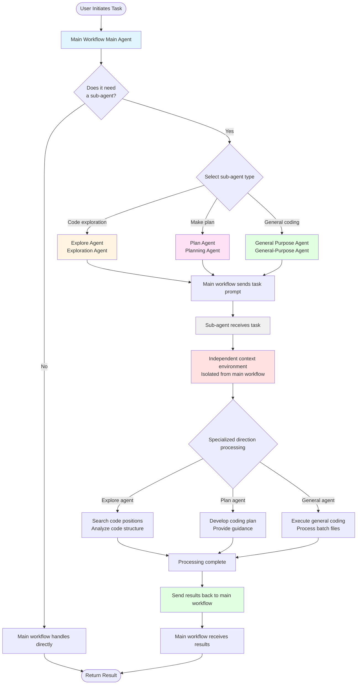

# Snow CLI User Guide - Sub-Agent Configuration

Welcome to Snow CLI! Agentic coding in your terminal.

## What are Sub-Agents

Sub-agents are branches of the main workflow in Snow CLI, designed to handle specific individual tasks to save context usage in the main workflow.

## Three Built-in System Sub-Agents

- Explore Agent - An exploration agent for searching code functionality for the main workflow, focusing on locating code positions.

- Plan Agent - A planning agent for developing comprehensive coding plans and guidance for the main workflow.

- General Purpose Agent - A general-purpose agent that provides common coding functionality for the main workflow, suitable for completing tasks that are singular but involve many files (e.g., internationalization).

## Sub-Agent Workflow



### Workflow Description

1. **Main Workflow Assessment**: After receiving a user task, the main workflow first evaluates whether a sub-agent is needed.
2. **Sub-Agent Selection**: Select an appropriate sub-agent based on the task type:

   - **Explore Agent**: Deep code exploration (5+ files), complex dependency tracing
   - **Plan Agent**: Breaking down complex features, major refactoring planning
   - **General Purpose Agent**: Batch modifications (5+ files), systematic refactoring

3. **Task Dispatch**: The main workflow sends a task prompt containing complete context to the sub-agent.

4. **Independent Processing**: The sub-agent processes the task in an independent context environment, completely isolated from the main workflow.

5. **Specialized Processing**: Each sub-agent performs targeted processing according to its specialized direction.

6. **Return Results**: After processing is complete, the sub-agent sends the results back to the main workflow.

7. **Main Workflow Continues**: The main workflow receives the results and continues with subsequent work.

### Key Features

- **Context Isolation**: Sub-agents have independent context that does not affect the main workflow's conversation history.
- **One-Way Communication**: Main workflow → Send task → Sub-agent → Return results → Main workflow
- **Specialized Division of Labor**: Each sub-agent focuses on a specific domain, improving processing efficiency.
- **Resource Conservation**: Prevents the main workflow context from being occupied by extensive exploration or planning information.

## Sub-Agent Configuration Management

### Adding a Sub-Agent

You can create custom sub-agents through the configuration interface to meet specific business needs.

#### Operation Steps

1. **Enter Configuration Interface**

   - Select "Sub-Agent Configuration" in the main menu
   - Select "Add Sub-Agent"

2. **Basic Information Configuration**

   Fill in the following fields as prompted by the interface:

   - **Agent Name** (Required)

     - Enter the name of the sub-agent
     - Suggest using descriptive names like "Code Review Agent", "Testing Agent", etc.
     - Press Enter to confirm and move to the next field

   - **Description** (Required)

     - Enter the function description of the sub-agent
     - Describe in detail the purpose and application scenarios of this sub-agent
     - Press Enter to confirm and move to the next field

   - **Role Definition** (Required)
     - Define the role and behavioral norms of the sub-agent
     - This is the core system prompt for the sub-agent, determining its working method
     - Example:
       ```
       You are a professional code review assistant.
       Your responsibilities are:
       1. Check code quality and compliance
       2. Discover potential bugs and security issues
       3. Provide improvement suggestions and best practices
       ```
     - Press Enter to confirm and move to the next field

3. **Advanced Configuration Options**

   **Important Reminder**: Sub-agents support three advanced custom configurations that allow sub-agents to use different configurations from the main workflow:

   - **Configuration File** (Optional)

     - Specify a dedicated API configuration file for the sub-agent
     - Purpose: Allow the sub-agent to use different API endpoints or different AI models
     - Operation:
       - Use ↑/↓ arrow keys to browse available configuration files
       - Press Space to select/deselect
       - Use ←/→ arrow keys to quickly switch between configuration options
       - Marker description: `❯` indicates cursor position, `[✓]` indicates selected
     - Application scenarios:
       - Let the sub-agent use more powerful models (such as Claude Opus)
       - Let the sub-agent use different API providers
       - Allocate different billing accounts for different sub-agents

   - **System Prompt** (Optional)

     - Specify a dedicated system prompt configuration for the sub-agent
     - Purpose: Add additional behavioral norms or constraints based on the role definition
     - Operation:
       - Use ↑/↓ arrow keys to browse available system prompts
       - Press Space to select/deselect
       - Use ←/→ arrow keys to quickly switch between configuration options
     - Application scenarios:
       - Add domain-specific professional knowledge
       - Add code style specifications
       - Add security review checklists

   - **Custom Request Headers** (Optional)
     - Specify dedicated HTTP request header configuration for the sub-agent
     - Purpose: Use different authentication or metadata when calling APIs
     - Operation:
       - Use ↑/↓ arrow keys to browse available request header schemes
       - Press Space to select/deselect
       - Use ←/→ arrow keys to quickly switch between configuration options
     - Application scenarios:
       - Use different API keys
       - Add specific tracking identifiers
       - Set different request priorities

4. **Tool Permission Configuration**

   Select the tools that the sub-agent can use:

   - Use ↑/↓ arrow keys to navigate between tool categories
   - Use ←/→ arrow keys to switch between tool categories
   - Press Space to select/deselect tools
   - Tool categories include:
     - Filesystem tools (filesystem-read, filesystem-create, filesystem-edit, etc.)
     - ACE code search tools (ace-find_definition, ace-semantic_search, etc.)
     - Codebase tools (codebase-search)
     - Terminal tools (terminal-execute)
     - TODO management tools
     - Web search tools
     - MCP tools (if configured)

   **Suggestion**: Only grant the minimum set of permissions needed for the sub-agent to complete its tasks.

5. **Save Configuration**

   - Press Ctrl+S to save the configuration
   - The system will automatically validate the configuration's completeness
   - Return to the main menu after successful save

#### Configuration Inheritance Explanation

When creating a new sub-agent, if the three advanced configurations (configuration file, system prompt, custom request headers) are not specified, the sub-agent will automatically inherit the currently active configuration of the main workflow. This means:

- The sub-agent will use the same API configuration as the main workflow
- The sub-agent will use the same system prompt as the main workflow (except for its own role definition)
- The sub-agent will use the same request headers as the main workflow

### Editing a Sub-Agent

You can edit existing sub-agent configurations, including the three built-in system agents.

#### Operation Steps

1. **Enter Edit Interface**

   - Select "Sub-Agent Configuration" in the main menu
   - Select the sub-agent to edit

2. **Edit Restrictions Explanation**

   **System Built-in Agents** (Explore Agent, Plan Agent, General Purpose Agent):

   - Name, description, and role definition are read-only and cannot be modified
   - The interface will display "(System Built-in - Not Modifiable)" prompt
   - Can modify: Tool permissions, configuration file, system prompt, custom request headers

   **Custom Agents**:

   - All fields can be modified

3. **Modify Configuration**

   Navigation and operation methods are the same as adding an agent:

   - Use ↑/↓ arrow keys to navigate between fields
   - Use ←/→ arrow keys to switch between configuration options
   - Press Space to select/deselect
   - Directly input modification content in text fields

4. **Save Changes**

   - Press Ctrl+S to save changes
   - The system will validate the modified configuration
   - Return to the main menu after successful save

#### Edit Configuration Inheritance Explanation

When editing an existing sub-agent:

- If the sub-agent already has custom configurations, the interface will display and load these configurations
- If the sub-agent does not have custom configurations:
  - When editing a copy of a system built-in agent, it will automatically inherit the current main workflow's configuration as default values
  - When editing an existing custom agent, configurations will not be automatically filled (remain unselected)

### Configuration Best Practices

1. **Clear Role Definition**

   - Clearly describe the scope of responsibilities of the sub-agent
   - Provide specific work steps or checklists
   - Specify output format and quality standards

2. **Reasonable Tool Permission Allocation**

   - Follow the principle of least privilege
   - Read-only tasks do not grant write tools
   - Exploration tasks do not grant execution tools

3. **Good Use of Configuration Isolation**

   - Configure different sub-agents for different types of tasks
   - Use different API configurations to control costs
   - Use different system prompts to optimize professional capabilities

4. **Test Configuration Effects**
   - Perform small-scale testing after creation
   - Observe whether the sub-agent's behavior meets expectations
   - Adjust role definition and tool permissions based on actual effects

### Keyboard Shortcuts

- **↑/↓**: Navigate between options or scroll lists
- **←/→**: Switch between fields (configuration options, tool categories)
- **Space**: Select/deselect (tools, configuration options)
- **Enter**: Confirm input and move to next field
- **Ctrl+S**: Save configuration
- **Ctrl+C** or **ESC**: Cancel and return

### Common Questions

**Q: Can sub-agents use the context of the main workflow?**

A: No. Sub-agents are completely isolated from the main workflow's context. The main workflow needs to provide all necessary context information in the prompt when calling a sub-agent.

**Q: How can I make a sub-agent use a more powerful model?**

A: In the configuration file option, specify an API configuration file that uses a more powerful model for the sub-agent.

**Q: What is the difference between system prompt and role definition?**

A: Role definition is the core behavioral specification of the sub-agent and is required. System prompt is an optional additional constraint that can add specific behavioral rules or domain knowledge to the sub-agent without modifying the role definition.

**Q: Will editing a system built-in agent affect the original configuration?**

A: No. The core definitions (name, description, role) of system built-in agents are read-only. You can only modify their tool permissions and advanced configurations, and these modifications only affect your usage without changing the system presets.

**Q: How do I delete a custom sub-agent?**

A: Select the sub-agent to delete in the sub-agent list, press the Delete key or select the delete option. System built-in agents cannot be deleted.
