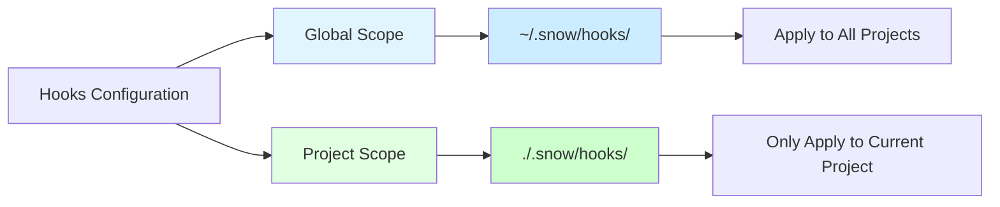
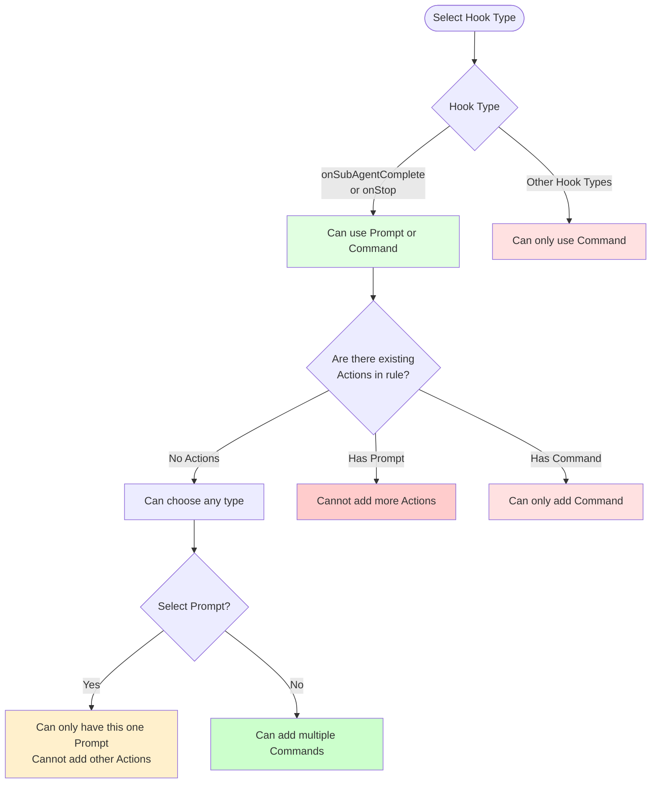

# Snow CLI User Guide - Hooks Configuration

Welcome to Snow CLI! Agentic coding in your terminal.

## What are Hooks

Hooks are a powerful extension mechanism provided by Snow CLI that allow you to automatically execute custom commands or trigger interactive prompts at key points in the AI workflow. With Hooks, you can:

- Automatically execute scripts or commands at specific moments
- Implement workflow automation
- Integrate external tools and services
- Perform validation or logging before and after critical operations
- Trigger interactive prompts at the end of workflows

## Hooks Workflow

```mermaid
graph TB
    Start([AI Workflow Start]) --> UserMsg{User Sends Message}

    UserMsg -->|Trigger| Hook1[onUserMessage Hook]
    Hook1 --> CheckMatch1{Match Rule?}
    CheckMatch1 -->|Yes| Execute1[Execute Hook Actions]
    CheckMatch1 -->|No| Continue1[Continue Flow]
    Execute1 --> Continue1

    Continue1 --> AIProcess[AI Process Message]

    AIProcess --> ToolCall{AI Call Tool?}

    ToolCall -->|Yes| Hook2[beforeToolCall Hook]
    Hook2 --> CheckMatch2{Match Tool Name?}
    CheckMatch2 -->|Yes| Execute2[Execute Hook Actions]
    CheckMatch2 -->|No| Continue2[Continue Call]
    Execute2 --> Continue2

    Continue2 --> NeedConfirm{Need User Confirmation?}

    NeedConfirm -->|Yes| Hook3[toolConfirmation Hook]
    Hook3 --> CheckMatch3{Match Tool Name?}
    CheckMatch3 -->|Yes| Execute3[Execute Hook Actions]
    CheckMatch3 -->|No| UserConfirm[User Confirm]
    Execute3 --> UserConfirm

    UserConfirm --> ToolExec[Execute Tool]
    NeedConfirm -->|No| ToolExec

    ToolExec --> Hook4[afterToolCall Hook]
    Hook4 --> CheckMatch4{Match Tool Name?}
    CheckMatch4 -->|Yes| Execute4[Execute Hook Actions]
    CheckMatch4 -->|No| Continue4[Continue Flow]
    Execute4 --> Continue4

    Continue4 --> MoreTools{More Tools?}
    MoreTools -->|Yes| ToolCall
    MoreTools -->|No| AIResponse[AI Generate Response]

    ToolCall -->|No| AIResponse

    AIResponse --> SubAgent{Call Sub-Agent?}

    SubAgent -->|Yes| SubProcess[Sub-Agent Process]
    SubProcess --> Hook5[onSubAgentComplete Hook]
    Hook5 --> CheckMatch5{Match Rule?}
    CheckMatch5 -->|Yes| Execute5[Execute Hook Actions<br/>May be Prompt]
    CheckMatch5 -->|No| Continue5[Continue Flow]
    Execute5 --> Continue5
    Continue5 --> CheckCompress

    SubAgent -->|No| CheckCompress{Need Compress Context?}

    CheckCompress -->|Yes| Hook6[beforeCompress Hook]
    Hook6 --> Execute6[Execute Hook Actions]
    Execute6 --> Compress[Execute Compression]
    Compress --> End

    CheckCompress -->|No| End([Flow End])

    End --> Hook7[onStop Hook]
    Hook7 --> Execute7[Execute Hook Actions<br/>May be Prompt]
    Execute7 --> FinalEnd([Final End])

    style Hook1 fill:#ffe1e1
    style Hook2 fill:#e1f5ff
    style Hook3 fill:#fff4e1
    style Hook4 fill:#e1ffe1
    style Hook5 fill:#ffe1f5
    style Hook6 fill:#f5e1ff
    style Hook7 fill:#ffe1e1
    style Execute1 fill:#ffcccc
    style Execute2 fill:#ccecff
    style Execute3 fill:#fff0cc
    style Execute4 fill:#ccffcc
    style Execute5 fill:#ffccf5
    style Execute6 fill:#f0ccff
    style Execute7 fill:#ffcccc
```



## Hook Type Descriptions

Snow CLI provides 8 hook types, each triggered at different moments:

### 1. onSessionStart

**Trigger Time**: When starting a new session or resuming an existing session

**Use Cases**:

- Initialize working environment
- Check dependencies and configurations
- Load project-specific settings
- Log session start time

**Example**:

```json
{
	"onSessionStart": [
		{
			"description": "Check development environment",
			"hooks": [
				{
					"type": "command",
					"command": "node --version && npm --version",
					"timeout": 5000,
					"enabled": true
				}
			]
		}
	]
}
```

### 2. onUserMessage

**Trigger Time**: When user sends a message

**Context Parameters**:

```json
{
	"message": "User message content", // User message text
	"imageCount": 2, // Number of images attached
	"source": "cli" // Message source: "cli" or "mcp"
}
```

**Use Cases**:

- Log user requests
- Preprocess user input
- Trigger specific monitoring or statistics
- Execute automated tasks based on message content

**Accessing Context**:

For `command` type hooks, context is passed via stdin as JSON. You can read it using:

```javascript
const context = JSON.parse(require('fs').readFileSync(0, 'utf-8'));
console.log('User message:', context.message);
console.log('Image count:', context.imageCount);
```

**Example**:

```json
{
	"onUserMessage": [
		{
			"description": "Log user messages",
			"hooks": [
				{
					"type": "command",
					"command": "echo \"$(date): User message logged\" >> .snow/logs/user-messages.log",
					"timeout": 3000,
					"enabled": true
				}
			]
		}
	]
}
```

### 3. beforeToolCall

**Trigger Time**: Before AI calls a tool (supports tool matching)

**Special Feature**: Supports `matcher` field to match specific tool names

**Context Parameters**:

```json
{
	"toolName": "filesystem-edit", // Tool name to be called
	"args": {
		// Tool arguments
		"filePath": "src/index.ts",
		"startLine": 10,
		"endLine": 20,
		"newContent": "..."
	}
}
```

**Use Cases**:

- Backup before file operations
- Environment check before executing commands
- Log tool call history
- Preprocessing for specific tools

**Placeholder Usage**:

For `prompt` type hooks, you can use the `$TOOLSRESULT$` placeholder to access the full context data.

**Matcher Syntax**:

- Exact match: `filesystem-read`
- Wildcard match: `filesystem-*` (matches all filesystem tools)
- Multiple tools: `filesystem-read,filesystem-edit` (comma-separated)

**Example**:

```json
{
	"beforeToolCall": [
		{
			"matcher": "filesystem-edit,filesystem-create",
			"description": "Auto backup before file changes",
			"hooks": [
				{
					"type": "command",
					"command": "git add . && git commit -m \"Auto backup before file changes\"",
					"timeout": 10000,
					"enabled": true
				}
			]
		}
	]
}
```

### 4. toolConfirmation

**Trigger Time**: During tool confirmation (including sensitive command checks)

**Special Feature**: Supports `matcher` field to match specific tool names

**Use Cases**:

- Execute additional checks before user confirms sensitive operations
- Log operations requiring confirmation
- Send notifications to team members
- Pre-confirmation processing for specific tools

**Example**:

```json
{
	"toolConfirmation": [
		{
			"matcher": "terminal-execute",
			"description": "Send notification on sensitive command confirmation",
			"hooks": [
				{
					"type": "command",
					"command": "curl -X POST https://hooks.slack.com/... -d '{\"text\":\"Sensitive command needs confirmation\"}'",
					"timeout": 5000,
					"enabled": true
				}
			]
		}
	]
}
```

### 5. afterToolCall

**Trigger Time**: After tool call completes (supports tool matching)

**Special Feature**: Supports `matcher` field to match specific tool names

**Context Parameters**:

```json
{
	"toolName": "filesystem-edit", // Tool name
	"args": {
		// Tool arguments
		"filePath": "src/index.ts",
		"startLine": 10,
		"endLine": 20,
		"newContent": "..."
	},
	"result": {
		// Tool execution result
		"success": true,
		"message": "File edited successfully"
	},
	"error": null // Error message (if execution failed)
}
```

**Use Cases**:

- Run tests after file modifications
- Run code formatting after code changes
- Log tool execution results
- Post-processing for specific tools

**Placeholder Usage**:

For `prompt` type hooks, you can use the `$TOOLSRESULT$` placeholder to access the full context data (including result and error).

**Example**:

```json
{
	"afterToolCall": [
		{
			"matcher": "filesystem-edit",
			"description": "Auto format after code changes",
			"hooks": [
				{
					"type": "command",
					"command": "npm run format",
					"timeout": 30000,
					"enabled": true
				}
			]
		}
	]
}
```

### 6. onSubAgentComplete

**Trigger Time**: When sub-agent task completes

**Special Feature**: Supports `prompt` type Action (interactive prompt)

**Context Parameters**:

```json
{
	"agentId": "agent_explore", // Sub-agent ID
	"agentName": "Explore Agent", // Sub-agent name
	"content": "Sub-agent response...", // Sub-agent output content
	"success": true, // Whether execution succeeded
	"usage": {
		// Token usage statistics
		"totalTokens": 1500,
		"promptTokens": 1000,
		"completionTokens": 500
	}
}
```

**Use Cases**:

- Collect user feedback after sub-agent completes
- Ask user whether to continue to next step
- Let user choose handling method
- Log sub-agent execution results

**Placeholder Usage**:

For `prompt` type hooks, you can use the `$SUBAGENTRESULT$` placeholder to access sub-agent context data.

**Prompt Type Description**:

- `prompt` type pauses AI flow and waits for user input
- User input is sent as a new message to AI
- Can only be used in `onSubAgentComplete` and `onStop`
- If a rule has `prompt` type, no other Actions can be added

**Example (Prompt Type)**:

```json
{
	"onSubAgentComplete": [
		{
			"description": "Ask user after sub-agent completes",
			"hooks": [
				{
					"type": "prompt",
					"prompt": "Sub-agent has completed the task. Do you need to continue? Please enter your instructions:",
					"timeout": 30000,
					"enabled": true
				}
			]
		}
	]
}
```

**Example (Command Type)**:

```json
{
	"onSubAgentComplete": [
		{
			"description": "Log sub-agent results",
			"hooks": [
				{
					"type": "command",
					"command": "echo \"Sub-agent completed at $(date)\" >> .snow/logs/subagent.log",
					"timeout": 3000,
					"enabled": true
				}
			]
		}
	]
}
```

### 7. beforeCompress

**Trigger Time**: Before running context compression operation

**Use Cases**:

- Save context snapshot before compression
- Log compression operation timestamp
- Trigger context backup
- Send compression notification

**Example**:

```json
{
	"beforeCompress": [
		{
			"description": "Save context before compression",
			"hooks": [
				{
					"type": "command",
					"command": "echo \"Context compression at $(date)\" >> .snow/logs/compression.log",
					"timeout": 3000,
					"enabled": true
				}
			]
		}
	]
}
```

### 8. onStop

**Trigger Time**: When user stops AI flow (Ctrl+C or end session)

**Special Feature**: Supports `prompt` type Action (interactive prompt)

**Context Parameters**:

```json
{
	"messages": [
		// Complete session message history
		{
			"role": "user",
			"content": "User message content"
		},
		{
			"role": "assistant",
			"content": "AI response content"
		}
		// ... more messages
	]
}
```

**Use Cases**:

- Ask user whether to save work before stopping
- Collect user feedback
- Execute cleanup operations
- Log stop reason

**Placeholder Usage**:

For `prompt` type hooks, you can use the `$STOPSESSION$` placeholder to access session context data.

**Example (Prompt Type)**:

```json
{
	"onStop": [
		{
			"description": "Ask before stopping",
			"hooks": [
				{
					"type": "prompt",
					"prompt": "About to stop AI. Do you need to save current work? Please enter instructions:",
					"timeout": 30000,
					"enabled": true
				}
			]
		}
	]
}
```

## Hook Configuration Management

### Accessing Configuration Interface

1. Launch Snow CLI
2. Select "Hooks Configuration" option in main menu
3. Choose configuration scope (Global or Project)

### Scope Description



**Global Hooks**:

- Storage location: `~/.snow/hooks/`
- Scope: All projects using Snow CLI
- Use cases: Common workflows, global monitoring, unified logging

**Project Hooks**:

- Storage location: `./.snow/hooks/` (current project directory)
- Scope: Current project only
- Use cases: Project-specific automation, special build processes, project-level validation

**Execution Priority**: Both project and global hooks will execute, with project hooks executing first

### Viewing Hook List

The configuration interface displays all 8 hook types:

- Configured hooks show `[✓]` marker
- Unconfigured hooks show `[ ]` marker
- Display the number of rules for each hook
- Bottom shows description of currently selected hook

### Configuring Hook Rules

#### 1. Select Hook Type

Use ↑/↓ arrow keys to select the hook type to configure, press Enter to enter details page

#### 2. Hook Details Page

Displays all rules under this hook:

- Rule list (shows description, number of Actions, Matcher information)
- Add new rule option
- Delete entire hook configuration option
- Return to previous level option

#### 3. Edit Rule

Select a rule or choose "Add New Rule" to enter editing interface:

**Basic Fields**:

- **Description** (required)

  - Brief description of the rule
  - Press Enter or Tab to move to next field
  - Helps you quickly identify rule purpose

- **Matcher** (only for tool hooks)
  - Only shown in `beforeToolCall`, `toolConfirmation`, `afterToolCall`
  - Used to match specific tool names
  - Supports wildcards: `filesystem-*`
  - Supports multiple tools: `filesystem-read,filesystem-edit`
  - Leave empty to match all tools

**Action Management**:

Each rule can contain multiple Actions, executed in order:

- View existing Action list
- Add new Action
- Edit existing Actions
- Delete Actions

#### 4. Edit Action

Select an Action or choose "Add Action" to enter Action editing interface:

**Action Fields**:

- **Enabled Status** (required)

  - Use Space key to toggle enabled/disabled
  - `[✓]` means enabled, `[ ]` means disabled
  - Disabled Actions won't execute but configuration is retained

- **Type** (required)

  - `command`: Execute command
  - `prompt`: Interactive prompt (only supported in `onSubAgentComplete` and `onStop`)
  - Press Space key to toggle type
  - Type switching has restrictions (see below)

- **Command** (when type=command)

  - Command line command to execute
  - Supports pipes and complex commands
  - Example: `npm run build && npm test`

- **Prompt** (when type=prompt)

  - Prompt text to display to user
  - User input will be sent as a new message to AI
  - Example: "Please enter your next instruction:"

- **Timeout** (optional)
  - Timeout duration (milliseconds)
  - Default: command=5000ms, prompt=30000ms
  - Action will be terminated after timeout

#### 5. Action Type Restrictions



**Restriction Rules**:

1. **Prompt Type Restrictions**:

   - Can only be used in `onSubAgentComplete` and `onStop`
   - If a rule has Prompt, it cannot have any other Actions
   - Prompt must exist alone

2. **Command Type**:

   - Can be used in all hook types
   - A rule can have multiple Command Actions
   - If the rule already has Prompt, cannot add Command

3. **Type Switching**:
   - System automatically validates when switching types
   - Non-compliant switches will be blocked

### Saving and Deleting

**Save Rule**:

- Select "Save Rule" in rule editing interface
- Configuration is immediately saved to corresponding scope
- Automatically returns to Hook details page after saving

**Delete Rule**:

- Select "Delete Rule" in rule editing interface or press `D` key
- Press `D` key for quick delete (must be in rule editing interface)
- Automatically returns to Hook details page after deletion

**Delete Hook Configuration**:

- Select "Delete Hook" in Hook details page
- Will delete the configuration file for this Hook
- Returns to Hook list after deletion

## Keyboard Shortcuts

### Hook List Interface

- **↑/↓**: Navigate between Hook types
- **Enter**: Enter selected Hook details
- **ESC**: Return to main menu

### Hook Details Interface

- **↑/↓**: Navigate in rule list
- **Enter**: Edit selected rule or execute operation
- **ESC**: Return to Hook list

### Rule Editing Interface

- **↑/↓**: Navigate between fields and Actions
- **Enter**: Edit field or Action
- **D**: Quick delete current rule
- **ESC**: Return to Hook details

### Action Editing Interface

- **↑/↓**: Navigate between fields
- **Space**: Toggle enabled status or type
- **Enter**: Edit text field
- **D**: Quick delete current Action
- **ESC**: Return to rule editing

### Text Input State

- **Enter**: Confirm input
- **ESC**: Cancel input

## Configuration File Structure

Hooks configuration is stored in JSON files, with each hook type corresponding to one file:

**File Location**:

- Global: `~/.snow/hooks/<hookType>.json`
- Project: `./.snow/hooks/<hookType>.json`

**File Format**:

```json
{
	"hookType": [
		{
			"description": "Rule description",
			"matcher": "Tool matcher (only for tool hooks)",
			"hooks": [
				{
					"type": "command",
					"command": "Command to execute",
					"timeout": 5000,
					"enabled": true
				}
			]
		}
	]
}
```

## Practical Configuration Examples

### Example 1: Automated Testing Flow

```json
{
	"afterToolCall": [
		{
			"matcher": "filesystem-edit",
			"description": "Auto run tests after code changes",
			"hooks": [
				{
					"type": "command",
					"command": "npm run lint",
					"timeout": 15000,
					"enabled": true
				},
				{
					"type": "command",
					"command": "npm test",
					"timeout": 60000,
					"enabled": true
				}
			]
		}
	]
}
```

### Example 2: File Backup System

```json
{
	"beforeToolCall": [
		{
			"matcher": "filesystem-*",
			"description": "Auto backup before file operations",
			"hooks": [
				{
					"type": "command",
					"command": "mkdir -p .snow/backups && cp -r . .snow/backups/$(date +%Y%m%d_%H%M%S)/",
					"timeout": 30000,
					"enabled": true
				}
			]
		}
	]
}
```

### Example 3: Workflow Logging

```json
{
	"onUserMessage": [
		{
			"description": "Log all user requests",
			"hooks": [
				{
					"type": "command",
					"command": "echo \"[$(date '+%Y-%m-%d %H:%M:%S')] User message received\" >> .snow/logs/workflow.log",
					"timeout": 3000,
					"enabled": true
				}
			]
		}
	]
}
```

### Example 4: Interactive Feedback Collection

```json
{
	"onSubAgentComplete": [
		{
			"description": "Collect feedback after sub-agent completes",
			"hooks": [
				{
					"type": "prompt",
					"prompt": "Sub-agent has completed the task. Please review the results and provide your feedback or next instruction:",
					"timeout": 60000,
					"enabled": true
				}
			]
		}
	]
}
```

### Example 5: Team Collaboration Notification

```json
{
	"toolConfirmation": [
		{
			"matcher": "terminal-execute",
			"description": "Notify team of sensitive operations",
			"hooks": [
				{
					"type": "command",
					"command": "curl -X POST $SLACK_WEBHOOK -H 'Content-Type: application/json' -d '{\"text\":\"Sensitive operation pending confirmation\"}'",
					"timeout": 5000,
					"enabled": true
				}
			]
		}
	]
}
```

### Example 6: Session Initialization Check

```json
{
	"onSessionStart": [
		{
			"description": "Check project environment",
			"hooks": [
				{
					"type": "command",
					"command": "node --version",
					"timeout": 3000,
					"enabled": true
				},
				{
					"type": "command",
					"command": "git status",
					"timeout": 3000,
					"enabled": true
				},
				{
					"type": "command",
					"command": "npm list --depth=0",
					"timeout": 10000,
					"enabled": true
				}
			]
		}
	]
}
```

## Configuration Best Practices

### 1. Set Reasonable Timeout Durations

- Simple commands: 3000-5000ms
- Build/test: 30000-60000ms
- Interactive Prompt: 30000-60000ms
- Avoid setting too short causing command interruption
- Avoid setting too long affecting workflow

### 2. Use Matcher for Precise Matching

- Avoid overly broad matching (like matching all tools)
- Target specific tools that need special handling
- Use wildcards to simplify configuration: `filesystem-*`
- Multiple related tools can share rules: `filesystem-read,filesystem-edit`

### 3. Command Execution Considerations

- Ensure commands are available in target environment
- Use absolute paths to avoid environment variable issues
- Consider cross-platform compatibility (Windows/Linux/macOS)
- Use environment variables to store sensitive information (like API keys)

### 4. Prompt Type Usage Suggestions

- Only use Prompt when necessary (interrupts workflow)
- Prompt message should be clear and specific
- Provide sufficient context to help user decision-making
- Set reasonable timeout duration

### 5. Rule Organization

- Each rule focuses on single responsibility
- Use clear descriptions to explain rule purpose
- Related Actions can be placed in the same rule
- Avoid duplicate logic between rules

### 6. Testing and Debugging

- Test new configurations in project scope first
- Apply to global scope after confirming correctness
- Use `enabled` field to temporarily disable Actions
- Check command output and error logs

### 7. Performance Considerations

- Avoid executing commands that take too long
- Consider using async background tasks
- Don't execute heavy operations in high-frequency hooks (like `onUserMessage`)
- Use disable feature reasonably to reduce unnecessary execution

## Frequently Asked Questions

**Q: Will Hooks affect AI response speed?**

A: Yes, to some extent. Hook commands execute synchronously, and the AI flow pauses during command execution. It's recommended to keep hook command execution time within a reasonable range.

**Q: Can I access AI context information in Hook commands?**

A: Currently Hook commands can only execute standard Shell commands and cannot directly access AI context. You can indirectly pass information through filesystem or environment variables.

**Q: What happens when project hooks and global hooks conflict?**

A: No conflict, both will execute. Project hooks execute first, then global hooks.

**Q: How do I debug Hook commands?**

A: It's recommended to manually execute commands in terminal first to ensure correctness, then use them in Hooks. You can also add log output to commands to track execution.

**Q: Can Prompt type Actions be called multiple times?**

A: No. A rule can only have one Prompt Action and cannot coexist with other Actions. If multiple interactions are needed, create multiple rules.

**Q: What happens if a Hook command fails?**

A: Command failure won't interrupt AI flow but will be logged. You can check logs for failure reasons. It's recommended to add error handling logic to commands.

**Q: Can I use Linux-style commands on Windows?**

A: Not recommended. You should write commands appropriate for the running platform, or use cross-platform tools (like Node.js scripts).

**Q: How do I disable a Hook without deleting the configuration?**

A: In the Action editing interface, use the Space key to toggle "Enabled Status". Disabled Actions retain configuration but won't execute.

**Q: Does Matcher support regular expressions?**

A: Currently only supports exact matching and wildcard `*`, doesn't support full regular expressions.

**Q: Can I manually edit configuration files?**

A: Yes, but it's recommended to use the configuration interface to ensure correct format. Restart Snow CLI after manual editing to load new configuration.
