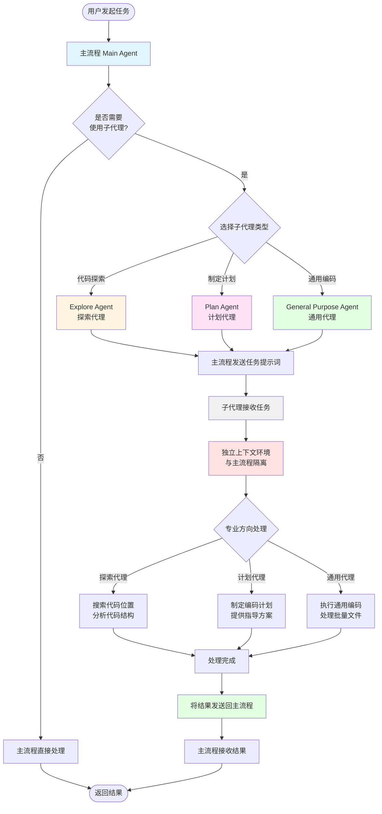

# Snow CLI 使用文档——子代理设置

欢迎使用 Snow CLI！在终端中进行 Agentic 编程。

## 什么是子代理

子代理是 Snow CLI 中主流程的分支，专门用于处理特定的单一需求以节约主流程的上下文占用

## 系统自带三个子代理

- Explore Agent——探索代理，用于为主流程搜索代码功能，专注查找代码位置

- Plan Agent——计划代理，用于为主流程制定全面的编码计划与指导

- General Purpose Agent——通用代理，用于为主流程提供通用的编码功能，可用于完成单一但是文件量较大的需求，例如（国际化）

## 子代理的工作流程



### 流程说明

1. **主流程评估**: 主流程接收到用户任务后，首先评估是否需要使用子代理
2. **子代理选择**: 根据任务类型选择合适的子代理：

   - **Explore Agent**: 深度代码探索（5+文件）、复杂依赖追踪
   - **Plan Agent**: 复杂功能拆解、重大重构规划
   - **General Purpose Agent**: 批量修改（5+文件）、系统性重构

3. **任务派发**: 主流程向子代理发送包含完整上下文的任务提示词

4. **独立处理**: 子代理在独立的上下文环境中处理任务，与主流程完全隔离

5. **专业处理**: 每个子代理根据自己的专业方向进行针对性处理

6. **结果返回**: 处理完成后，子代理将结果发送回主流程

7. **主流程继续**: 主流程接收结果并继续后续工作

### 关键特点

- **上下文隔离**: 子代理拥有独立的上下文，不会影响主流程的对话历史
- **单向通信**: 主流程 → 发送任务 → 子代理 → 返回结果 → 主流程
- **专业分工**: 每个子代理专注于特定领域，提高处理效率
- **资源节约**: 避免主流程上下文被大量探索或计划信息占用

## 子代理配置管理

### 新增子代理

通过配置界面可以创建自定义子代理，满足特定的业务需求。

#### 操作步骤

1. **进入配置界面**

   - 在主菜单中选择"子代理配置"选项
   - 选择"新增子代理"

2. **基础信息配置**

   按照界面提示依次填写以下字段：

   - **代理名称** (必填)

     - 输入子代理的名称
     - 建议使用描述性名称，如 "代码审查代理"、"测试代理" 等
     - 按 Enter 确认进入下一字段

   - **描述** (必填)

     - 输入子代理的功能描述
     - 详细说明该子代理的用途和应用场景
     - 按 Enter 确认进入下一字段

   - **角色定义** (必填)
     - 定义子代理的角色和行为规范
     - 这是子代理的核心系统提示词，决定其工作方式
     - 示例：
       ```
       你是一个专业的代码审查助手。
       你的职责是：
       1. 检查代码质量和规范性
       2. 发现潜在的bug和安全问题
       3. 提供改进建议和最佳实践
       ```
     - 按 Enter 确认进入下一字段

3. **高级配置选项**

   **重要提醒**: 子代理支持三项高级自定义配置，可以让子代理使用不同于主流程的配置：

   - **配置文件** (可选)

     - 为子代理指定专属的 API 配置文件
     - 用途：让子代理使用不同的 API 端点或不同的 AI 模型
     - 操作：
       - 使用 ↑/↓ 方向键浏览可用的配置文件
       - 按 Space 键选中/取消选中
       - 按 ←/→ 方向键在配置选项间快速切换
       - 标记说明：`❯` 表示光标位置，`[✓]` 表示已选中
     - 应用场景：
       - 让子代理使用更强大的模型（如 Claude Opus）
       - 让子代理使用不同的 API 提供商
       - 为不同子代理分配不同的计费账户

   - **系统提示词** (可选)

     - 为子代理指定专属的系统提示词配置
     - 用途：在角色定义的基础上，添加额外的行为规范或约束
     - 操作：
       - 使用 ↑/↓ 方向键浏览可用的系统提示词
       - 按 Space 键选中/取消选中
       - 按 ←/→ 方向键在配置选项间快速切换
     - 应用场景：
       - 添加特定领域的专业知识
       - 添加代码风格规范
       - 添加安全审查清单

   - **自定义请求头** (可选)
     - 为子代理指定专属的 HTTP 请求头配置
     - 用途：在调用 API 时使用不同的身份验证或元数据
     - 操作：
       - 使用 ↑/↓ 方向键浏览可用的请求头方案
       - 按 Space 键选中/取消选中
       - 按 ←/→ 方向键在配置选项间快速切换
     - 应用场景：
       - 使用不同的 API 密钥
       - 添加特定的追踪标识
       - 设置不同的请求优先级

4. **工具权限配置**

   选择子代理可以使用的工具：

   - 使用 ↑/↓ 方向键在工具类别间导航
   - 使用 ←/→ 方向键在工具类别间切换
   - 按 Space 键选中/取消选中工具
   - 工具类别包括：
     - 文件系统工具 (filesystem-read, filesystem-create, filesystem-edit 等)
     - ACE 代码搜索工具 (ace-find_definition, ace-semantic_search 等)
     - 代码库工具 (codebase-search)
     - 终端工具 (terminal-execute)
     - TODO 管理工具
     - Web 搜索工具
     - MCP 工具（如已配置）

   **建议**: 只授予子代理完成其任务所需的最小权限集

5. **保存配置**

   - 按 Ctrl+S 保存配置
   - 系统会自动验证配置的完整性
   - 保存成功后返回主菜单

#### 配置继承说明

新建子代理时，如果未指定三项高级配置（配置文件、系统提示词、自定义请求头），子代理将自动继承当前主流程激活的配置。这意味着：

- 子代理将使用与主流程相同的 API 配置
- 子代理将使用与主流程相同的系统提示词（除了自身的角色定义）
- 子代理将使用与主流程相同的请求头

### 编辑子代理

可以编辑现有的子代理配置，包括系统内置的三个代理。

#### 操作步骤

1. **进入编辑界面**

   - 在主菜单中选择"子代理配置"选项
   - 选择要编辑的子代理

2. **编辑限制说明**

   **系统内置代理**（Explore Agent、Plan Agent、General Purpose Agent）：

   - 名称、描述、角色定义为只读，不可修改
   - 界面会显示"(系统内置 - 不可修改)"提示
   - 可以修改：工具权限、配置文件、系统提示词、自定义请求头

   **自定义代理**：

   - 所有字段均可修改

3. **修改配置**

   导航和操作方式与新增代理相同：

   - 使用 ↑/↓ 方向键在字段间导航
   - 使用 ←/→ 方向键在配置选项间切换
   - 按 Space 键选中/取消选中
   - 在文本字段中直接输入修改内容

4. **保存更改**

   - 按 Ctrl+S 保存更改
   - 系统会验证修改后的配置
   - 保存成功后返回主菜单

#### 编辑配置继承说明

编辑已有子代理时：

- 如果子代理已有自定义配置，界面会显示并加载这些配置
- 如果子代理没有自定义配置：
  - 编辑系统内置代理的副本时，会自动继承当前主流程的配置作为默认值
  - 编辑已有的自定义代理时，不会自动填充配置（保持未选中状态）

### 配置最佳实践

1. **角色定义要明确**

   - 清楚描述子代理的职责范围
   - 提供具体的工作步骤或检查清单
   - 说明输出格式和质量标准

2. **合理分配工具权限**

   - 遵循最小权限原则
   - 只读任务不授予写入工具
   - 探索任务不授予执行工具

3. **善用配置隔离**

   - 为不同类型的任务配置不同的子代理
   - 使用不同的 API 配置控制成本
   - 使用不同的系统提示词优化专业能力

4. **测试配置效果**
   - 创建后先进行小规模测试
   - 观察子代理的行为是否符合预期
   - 根据实际效果调整角色定义和工具权限

### 键盘快捷键

- **↑/↓**: 在选项间导航或滚动列表
- **←/→**: 在字段间切换（配置选项、工具类别）
- **Space**: 选中/取消选中（工具、配置选项）
- **Enter**: 确认输入并移至下一字段
- **Ctrl+S**: 保存配置
- **Ctrl+C** 或 **ESC**: 取消并返回

### 常见问题

**Q: 子代理可以使用主流程的上下文吗？**

A: 不可以。子代理与主流程的上下文完全隔离。主流程需要在调用子代理时，在提示词中提供所有必要的上下文信息。

**Q: 如何让子代理使用更强大的模型？**

A: 在配置文件选项中，为子代理指定一个使用更强大模型的 API 配置文件即可。

**Q: 系统提示词和角色定义有什么区别？**

A: 角色定义是子代理的核心行为规范，是必填的。系统提示词是可选的额外约束，可以在不修改角色定义的情况下，为子代理添加特定的行为规则或领域知识。

**Q: 编辑系统内置代理会影响原始配置吗？**

A: 不会。系统内置代理的核心定义（名称、描述、角色）是只读的。您只能修改其工具权限和高级配置，这些修改只影响您的使用，不会改变系统预设。

**Q: 如何删除自定义子代理？**

A: 在子代理列表中选择要删除的子代理，按 Delete 键或选择删除选项即可。系统内置代理无法删除。
