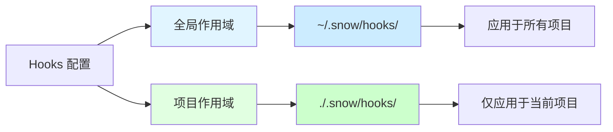
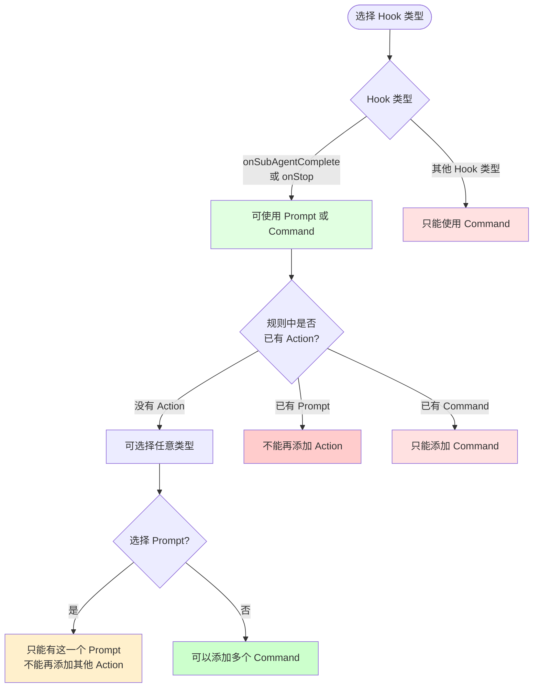

# Snow CLI 使用文档——Hooks 配置

欢迎使用 Snow CLI！在终端中进行 Agentic 编程。

## 什么是 Hooks

Hooks 是 Snow CLI 提供的强大扩展机制，允许您在 AI 工作流程的关键节点自动执行自定义命令或触发交互式提示。通过 Hooks，您可以：

- 在特定时机自动执行脚本或命令
- 实现工作流程的自动化
- 集成外部工具和服务
- 在关键操作前后进行验证或记录
- 在工作流程结束时触发交互式提示

## Hooks 工作流程

```mermaid
graph TB
    Start([AI 工作流程开始]) --> UserMsg{用户发送消息}

    UserMsg -->|触发| Hook1[onUserMessage Hook]
    Hook1 --> CheckMatch1{匹配规则?}
    CheckMatch1 -->|是| Execute1[执行 Hook Actions]
    CheckMatch1 -->|否| Continue1[继续流程]
    Execute1 --> Continue1

    Continue1 --> AIProcess[AI 处理消息]

    AIProcess --> ToolCall{AI 调用工具?}

    ToolCall -->|是| Hook2[beforeToolCall Hook]
    Hook2 --> CheckMatch2{匹配工具名称?}
    CheckMatch2 -->|是| Execute2[执行 Hook Actions]
    CheckMatch2 -->|否| Continue2[继续调用]
    Execute2 --> Continue2

    Continue2 --> NeedConfirm{需要用户确认?}

    NeedConfirm -->|是| Hook3[toolConfirmation Hook]
    Hook3 --> CheckMatch3{匹配工具名称?}
    CheckMatch3 -->|是| Execute3[执行 Hook Actions]
    CheckMatch3 -->|否| UserConfirm[用户确认]
    Execute3 --> UserConfirm

    UserConfirm --> ToolExec[执行工具]
    NeedConfirm -->|否| ToolExec

    ToolExec --> Hook4[afterToolCall Hook]
    Hook4 --> CheckMatch4{匹配工具名称?}
    CheckMatch4 -->|是| Execute4[执行 Hook Actions]
    CheckMatch4 -->|否| Continue4[继续流程]
    Execute4 --> Continue4

    Continue4 --> MoreTools{还有更多工具?}
    MoreTools -->|是| ToolCall
    MoreTools -->|否| AIResponse[AI 生成响应]

    ToolCall -->|否| AIResponse

    AIResponse --> SubAgent{调用子代理?}

    SubAgent -->|是| SubProcess[子代理处理]
    SubProcess --> Hook5[onSubAgentComplete Hook]
    Hook5 --> CheckMatch5{匹配规则?}
    CheckMatch5 -->|是| Execute5[执行 Hook Actions<br/>可能是 Prompt]
    CheckMatch5 -->|否| Continue5[继续流程]
    Execute5 --> Continue5
    Continue5 --> CheckCompress

    SubAgent -->|否| CheckCompress{需要压缩上下文?}

    CheckCompress -->|是| Hook6[beforeCompress Hook]
    Hook6 --> Execute6[执行 Hook Actions]
    Execute6 --> Compress[执行压缩]
    Compress --> End

    CheckCompress -->|否| End([流程结束])

    End --> Hook7[onStop Hook]
    Hook7 --> Execute7[执行 Hook Actions<br/>可能是 Prompt]
    Execute7 --> FinalEnd([最终结束])

    style Hook1 fill:#ffe1e1
    style Hook2 fill:#e1f5ff
    style Hook3 fill:#fff4e1
    style Hook4 fill:#e1ffe1
    style Hook5 fill:#ffe1f5
    style Hook6 fill:#f5e1ff
    style Hook7 fill:#ffe1e1
    style Execute1 fill:#ffcccc
    style Execute2 fill:#ccecff
    style Execute3 fill:#fff0cc
    style Execute4 fill:#ccffcc
    style Execute5 fill:#ffccf5
    style Execute6 fill:#f0ccff
    style Execute7 fill:#ffcccc
```



## Hook 类型说明

Snow CLI 提供 8 种 Hook 类型，每种类型在不同的时机触发：

### 1. onSessionStart

**触发时机**: 当启动新会话或恢复现有会话时

**应用场景**:

- 初始化工作环境
- 检查依赖和配置
- 加载项目特定的设置
- 记录会话开始时间

**示例**:

```json
{
	"onSessionStart": [
		{
			"description": "检查开发环境",
			"hooks": [
				{
					"type": "command",
					"command": "node --version && npm --version",
					"timeout": 5000,
					"enabled": true
				}
			]
		}
	]
}
```

### 2. onUserMessage

**触发时机**: 用户发送消息时

**上下文参数**:

```json
{
	"message": "用户输入的消息内容",
	"imageCount": 2, // 用户上传的图片数量
	"source": "normal" // 消息来源: "normal" 或 "pending"
}
```

**应用场景**:

- 记录用户请求
- 预处理用户输入
- 触发特定的监控或统计
- 根据消息内容执行自动化任务

**stdin 示例**:

```json
{
	"onUserMessage": [
		{
			"description": "记录用户消息",
			"hooks": [
				{
					"type": "command",
					"command": "node -e \"const d = JSON.parse(require('fs').readFileSync(0, 'utf-8')); console.log('User:', d.message.substring(0, 50))\"",
					"timeout": 3000,
					"enabled": true
				}
			]
		}
	]
}
```

### 3. beforeToolCall

**触发时机**: 在 AI 调用工具之前（支持工具匹配）

**特殊功能**: 支持 `matcher` 字段匹配特定工具名称

**上下文参数**:

```json
{
	"toolName": "filesystem-edit", // 工具名称
	"args": {
		// 工具参数
		"filePath": "src/index.ts",
		"startLine": 10,
		"endLine": 20,
		"newContent": "..."
	}
}
```

**应用场景**:

- 在文件操作前进行备份
- 在执行命令前进行环境检查
- 记录工具调用历史
- 针对特定工具的预处理

**Matcher 语法**:

- 精确匹配: `filesystem-read`
- 通配符匹配: `filesystem-*` (匹配所有文件系统工具)
- 多个工具: `filesystem-read,filesystem-edit` (逗号分隔)

**stdin 示例**:

```json
{
	"beforeToolCall": [
		{
			"matcher": "filesystem-edit,filesystem-create",
			"description": "文件修改前自动备份",
			"hooks": [
				{
					"type": "command",
					"command": "git add . && git commit -m \"Auto backup before file changes\"",
					"timeout": 10000,
					"enabled": true
				}
			]
		}
	]
}
```

### 4. toolConfirmation

**触发时机**: 工具二次确认时（包括敏感命令检查）

**特殊功能**: 支持 `matcher` 字段匹配特定工具名称

**应用场景**:

- 在用户确认敏感操作前执行额外检查
- 记录需要确认的操作
- 发送通知给团队成员
- 针对特定工具的确认前处理

**示例**:

```json
{
	"toolConfirmation": [
		{
			"matcher": "terminal-execute",
			"description": "敏感命令确认时发送通知",
			"hooks": [
				{
					"type": "command",
					"command": "curl -X POST https://hooks.slack.com/... -d '{\"text\":\"Sensitive command needs confirmation\"}'",
					"timeout": 5000,
					"enabled": true
				}
			]
		}
	]
}
```

### 5. afterToolCall

**触发时机**: 工具调用完成后（支持工具匹配）

**特殊功能**: 支持 `matcher` 字段匹配特定工具名称

**上下文参数**:

```json
{
	"toolName": "filesystem-edit", // 工具名称
	"args": {
		// 工具参数
		"filePath": "src/index.ts",
		"startLine": 10,
		"endLine": 20,
		"newContent": "..."
	},
	"result": {
		// 工具执行结果
		"success": true,
		"message": "File edited successfully"
	},
	"error": null // 错误信息（如果执行失败）
}
```

**应用场景**:

- 在文件修改后运行测试
- 在代码变更后运行代码格式化
- 记录工具执行结果
- 针对特定工具的后处理

**占位符使用**:

在 `prompt` 类型中可以使用 `$TOOLSRESULT$` 占位符访问完整的上下文数据（包括 result 和 error）。

**示例**:

```json
{
	"afterToolCall": [
		{
			"matcher": "filesystem-edit",
			"description": "代码修改后自动格式化",
			"hooks": [
				{
					"type": "command",
					"command": "npm run format",
					"timeout": 30000,
					"enabled": true
				}
			]
		}
	]
}
```

### 6. onSubAgentComplete

**触发时机**: 子代理任务完成时

**特殊功能**: 支持 `prompt` 类型 Action（交互式提示）

**Hook 可接收的上下文参数**:
所有 Hooks 都可以接收主流程传递的上下文参数。这些参数会通过 **stdin** 以 JSON 格式传递给 `command` 类型的 Hook，或通过 **占位符** 注入到 `prompt` 类型的 Hook 中。

**onSubAgentComplete 的上下文参数**:

```json
{
	"agentId": "agent_explore", // 子代理ID
	"agentName": "Explore Agent", // 子代理名称
	"content": "子代理输出的内容", // 子代理返回的内容
	"success": true, // 子代理执行是否成功
	"usage": {
		// 子代理的 token 使用情况（如果有）
		"prompt_tokens": 1000,
		"completion_tokens": 500,
		"total_tokens": 1500
	}
}
```

**应用场景**:

- 子代理完成后收集用户反馈
- 询问用户是否继续下一步
- 让用户选择处理方式
- 记录子代理执行结果

**Prompt 类型说明**:

- `prompt` 类型会暂停 AI 流程，等待用户输入
- 用户输入的内容会作为新消息发送给 AI
- 只能在 `onSubAgentComplete` 和 `onStop` 中使用
- 一个规则中如果有 `prompt` 类型，不能再有其他 Action

**Prompt 类型的上下文占位符使用**:

在 `prompt` 类型的 Hook 中，可以使用 `$SUBAGENTRESULT$` 占位符来访问上下文数据：

```json
{
	"onSubAgentComplete": [
		{
			"description": "子代理完成后询问用户",
			"hooks": [
				{
					"type": "prompt",
					"prompt": "子代理已完成任务。上下文数据: $SUBAGENTRESULT$\n\n是否需要继续？请输入您的指示：",
					"timeout": 30000,
					"enabled": true
				}
			]
		}
	]
}
```

占位符会被替换为完整的上下文 JSON，小模型会根据上下文和提示词生成回复。

**Command 类型的 stdin 使用**:

在 `command` 类型的 Hook 中，上下文数据会通过 **stdin** 以 JSON 格式传递：

```json
{
	"onSubAgentComplete": [
		{
			"description": "记录子代理结果",
			"hooks": [
				{
					"type": "command",
					"command": "node -e \"const data = JSON.parse(require('fs').readFileSync(0, 'utf-8')); console.log('Agent:', data.agentName, 'Success:', data.success)\"",
					"timeout": 3000,
					"enabled": true
				}
			]
		}
	]
}
```

你的命令可以通过读取 stdin 来获取完整的上下文数据。

### 7. beforeCompress

**触发时机**: 在即将运行上下文压缩操作之前

**应用场景**:

- 保存压缩前的上下文快照
- 记录压缩操作的时间点
- 触发上下文备份
- 发送压缩通知

**示例**:

```json
{
	"beforeCompress": [
		{
			"description": "压缩前保存上下文",
			"hooks": [
				{
					"type": "command",
					"command": "echo \"Context compression at $(date)\" >> .snow/logs/compression.log",
					"timeout": 3000,
					"enabled": true
				}
			]
		}
	]
}
```

### 8. onStop

**触发时机**: 用户停止 AI 流程时（Ctrl+C 或结束会话）

**特殊功能**: 支持 `prompt` 类型 Action（交互式提示）

**上下文参数**:

```json
{
	"messages": [
		// 完整的会话消息历史记录
		{
			"role": "user",
			"content": "用户消息内容"
		},
		{
			"role": "assistant",
			"content": "AI 响应内容"
		}
		// ... 更多消息
	]
}
```

**应用场景**:

- 在停止前询问用户是否保存工作
- 收集用户反馈
- 执行清理操作
- 记录停止原因

**占位符使用**:

在 `prompt` 类型中可以使用 `$STOPSESSION$` 占位符访问会话上下文数据。

**示例（Prompt 类型）**:

```json
{
	"onStop": [
		{
			"description": "停止前询问",
			"hooks": [
				{
					"type": "prompt",
					"prompt": "即将停止 AI，是否需要保存当前工作？请输入指示：",
					"timeout": 30000,
					"enabled": true
				}
			]
		}
	]
}
```

## Hook 配置管理

### 进入配置界面

1. 启动 Snow CLI
2. 在主菜单中选择"Hooks 配置"选项
3. 选择配置作用域（全局或项目）

### 作用域说明



**全局 Hooks**:

- 存储位置: `~/.snow/hooks/`
- 应用范围: 所有使用 Snow CLI 的项目
- 适用场景: 通用的工作流程、全局监控、统一的日志记录

**项目 Hooks**:

- 存储位置: `./.snow/hooks/` (当前项目目录)
- 应用范围: 仅当前项目
- 适用场景: 项目特定的自动化、特殊的构建流程、项目级别的验证

**执行优先级**: 项目 Hooks 和全局 Hooks 都会执行，项目 Hooks 优先执行

### 查看 Hook 列表

配置界面会显示所有 8 种 Hook 类型：

- 已配置的 Hook 显示 `[✓]` 标记
- 未配置的 Hook 显示 `[ ]` 标记
- 显示每个 Hook 包含的规则数量
- 底部显示当前选中 Hook 的说明

### 配置 Hook 规则

#### 1. 选择 Hook 类型

使用 ↑/↓ 方向键选择要配置的 Hook 类型，按 Enter 进入详情页面

#### 2. Hook 详情页面

显示该 Hook 下的所有规则：

- 规则列表（显示描述、Action 数量、Matcher 信息）
- 添加新规则选项
- 删除整个 Hook 配置选项
- 返回上一级选项

#### 3. 编辑规则

选择一个规则或选择"添加新规则"进入编辑界面：

**基础字段**:

- **描述** (必填)

  - 规则的简短说明
  - 按 Enter 或 Tab 进入下一字段
  - 帮助您快速识别规则用途

- **Matcher** (仅工具 Hooks 需要)
  - 仅在 `beforeToolCall`、`toolConfirmation`、`afterToolCall` 中显示
  - 用于匹配特定的工具名称
  - 支持通配符: `filesystem-*`
  - 支持多个工具: `filesystem-read,filesystem-edit`
  - 留空表示匹配所有工具

**Action 管理**:

每个规则可以包含多个 Action，按顺序执行：

- 查看已有的 Action 列表
- 添加新 Action
- 编辑现有 Action
- 删除 Action

#### 4. 编辑 Action

选择一个 Action 或选择"添加 Action"进入 Action 编辑界面：

**Action 字段**:

- **启用状态** (必填)

  - 使用 Space 键切换启用/禁用
  - `[✓]` 表示启用，`[ ]` 表示禁用
  - 禁用的 Action 不会执行但会保留配置

- **类型** (必填)

  - `command`: 执行命令
  - `prompt`: 交互式提示（仅 `onSubAgentComplete` 和 `onStop` 支持）
  - 按 Space 键切换类型
  - 切换类型有限制（见下方说明）

- **Command** (type=command 时)

  - 要执行的命令行命令
  - 支持管道和复杂命令
  - 示例: `npm run build && npm test`

- **Prompt** (type=prompt 时)

  - 显示给用户的提示文本
  - 用户输入会作为新消息发送给 AI
  - 示例: "请输入您的下一步指示："

- **Timeout** (可选)
  - 超时时间（毫秒）
  - 默认值: command=5000ms, prompt=30000ms
  - 超时后 Action 会被终止

#### 5. Action 类型限制



**限制规则**:

1. **Prompt 类型限制**:

   - 只能在 `onSubAgentComplete` 和 `onStop` 中使用
   - 一个规则中如果有 Prompt，不能有任何其他 Action
   - Prompt 必须单独存在

2. **Command 类型**:

   - 可以在所有 Hook 类型中使用
   - 一个规则可以有多个 Command Action
   - 如果规则中已有 Prompt，不能添加 Command

3. **类型切换**:
   - 切换类型时系统会自动验证
   - 不符合规则的切换会被阻止

### 保存和删除

**保存规则**:

- 在规则编辑界面选择"保存规则"
- 配置会立即保存到对应的作用域
- 保存后自动返回 Hook 详情页面

**删除规则**:

- 在规则编辑界面选择"删除规则"或按 `D` 键
- 按 `D` 键可快速删除（需要在规则编辑界面）
- 删除后自动返回 Hook 详情页面

**删除 Hook 配置**:

- 在 Hook 详情页面选择"删除 Hook"
- 会删除该 Hook 的配置文件
- 删除后返回 Hook 列表

## 键盘快捷键

### Hook 列表界面

- **↑/↓**: 在 Hook 类型间导航
- **Enter**: 进入选中的 Hook 详情
- **ESC**: 返回主菜单

### Hook 详情界面

- **↑/↓**: 在规则列表中导航
- **Enter**: 编辑选中的规则或执行操作
- **ESC**: 返回 Hook 列表

### 规则编辑界面

- **↑/↓**: 在字段和 Action 间导航
- **Enter**: 编辑字段或 Action
- **D**: 快速删除当前规则
- **ESC**: 返回 Hook 详情

### Action 编辑界面

- **↑/↓**: 在字段间导航
- **Space**: 切换启用状态或类型
- **Enter**: 编辑文本字段
- **D**: 快速删除当前 Action
- **ESC**: 返回规则编辑

### 文本输入状态

- **Enter**: 确认输入
- **ESC**: 取消输入

## 配置文件结构

Hooks 配置存储在 JSON 文件中，每个 Hook 类型对应一个文件：

**文件位置**:

- 全局: `~/.snow/hooks/<hookType>.json`
- 项目: `./.snow/hooks/<hookType>.json`

**文件格式**:

```json
{
	"hookType": [
		{
			"description": "规则描述",
			"matcher": "工具匹配器（仅工具 Hooks）",
			"hooks": [
				{
					"type": "command",
					"command": "执行的命令",
					"timeout": 5000,
					"enabled": true
				}
			]
		}
	]
}
```

## 实用配置示例

### 示例 1: 自动化测试流程

```json
{
	"afterToolCall": [
		{
			"matcher": "filesystem-edit",
			"description": "代码修改后自动运行测试",
			"hooks": [
				{
					"type": "command",
					"command": "npm run lint",
					"timeout": 15000,
					"enabled": true
				},
				{
					"type": "command",
					"command": "npm test",
					"timeout": 60000,
					"enabled": true
				}
			]
		}
	]
}
```

### 示例 2: 文件备份系统

```json
{
	"beforeToolCall": [
		{
			"matcher": "filesystem-*",
			"description": "文件操作前自动备份",
			"hooks": [
				{
					"type": "command",
					"command": "mkdir -p .snow/backups && cp -r . .snow/backups/$(date +%Y%m%d_%H%M%S)/",
					"timeout": 30000,
					"enabled": true
				}
			]
		}
	]
}
```

### 示例 3: 工作流程记录

```json
{
	"onUserMessage": [
		{
			"description": "记录所有用户请求",
			"hooks": [
				{
					"type": "command",
					"command": "echo \"[$(date '+%Y-%m-%d %H:%M:%S')] User message received\" >> .snow/logs/workflow.log",
					"timeout": 3000,
					"enabled": true
				}
			]
		}
	]
}
```

### 示例 4: 交互式反馈收集

```json
{
	"onSubAgentComplete": [
		{
			"description": "子代理完成后收集反馈",
			"hooks": [
				{
					"type": "prompt",
					"prompt": "子代理已完成任务。请查看结果并提供您的反馈或下一步指示：",
					"timeout": 60000,
					"enabled": true
				}
			]
		}
	]
}
```

### 示例 5: 团队协作通知

```json
{
	"toolConfirmation": [
		{
			"matcher": "terminal-execute",
			"description": "敏感操作通知团队",
			"hooks": [
				{
					"type": "command",
					"command": "curl -X POST $SLACK_WEBHOOK -H 'Content-Type: application/json' -d '{\"text\":\"Sensitive operation pending confirmation\"}'",
					"timeout": 5000,
					"enabled": true
				}
			]
		}
	]
}
```

### 示例 6: 会话初始化检查

```json
{
	"onSessionStart": [
		{
			"description": "检查项目环境",
			"hooks": [
				{
					"type": "command",
					"command": "node --version",
					"timeout": 3000,
					"enabled": true
				},
				{
					"type": "command",
					"command": "git status",
					"timeout": 3000,
					"enabled": true
				},
				{
					"type": "command",
					"command": "npm list --depth=0",
					"timeout": 10000,
					"enabled": true
				}
			]
		}
	]
}
```

## 配置最佳实践

### 1. 合理设置超时时间

- 简单命令: 3000-5000ms
- 构建/测试: 30000-60000ms
- 交互式 Prompt: 30000-60000ms
- 避免设置过短导致命令被中断
- 避免设置过长影响工作流程

### 2. 使用 Matcher 精确匹配

- 避免过于宽泛的匹配（如匹配所有工具）
- 针对性地匹配需要特殊处理的工具
- 使用通配符简化配置: `filesystem-*`
- 多个相关工具可以共享规则: `filesystem-read,filesystem-edit`

### 3. 命令执行注意事项

- 确保命令在目标环境中可用
- 使用绝对路径避免环境变量问题
- 考虑跨平台兼容性（Windows/Linux/macOS）
- 使用环境变量存储敏感信息（如 API 密钥）

### 4. Prompt 类型使用建议

- 只在必要时使用 Prompt（会中断工作流程）
- 提示信息要清晰明确
- 提供足够的上下文帮助用户决策
- 设置合理的超时时间

### 5. 规则组织

- 每个规则专注于单一职责
- 使用清晰的描述说明规则用途
- 相关的 Action 可以放在同一规则中
- 避免规则间的重复逻辑

### 6. 测试和调试

- 先在项目作用域测试新配置
- 确认无误后再应用到全局作用域
- 使用 `enabled` 字段临时禁用 Action
- 检查命令输出和错误日志

### 7. 性能考虑

- 避免执行耗时过长的命令
- 考虑使用异步后台任务
- 不要在高频 Hook（如 `onUserMessage`）中执行重操作
- 合理使用禁用功能减少不必要的执行

## 常见问题

**Q: Hooks 会影响 AI 的响应速度吗？**

A: 会有一定影响。Hook 命令是同步执行的，命令执行期间 AI 流程会暂停。建议将 Hook 命令的执行时间控制在合理范围内。

**Q: 可以在 Hook 命令中访问 AI 的上下文信息吗？**

A: 目前 Hook 命令只能执行标准的 Shell 命令，无法直接访问 AI 的上下文。您可以通过文件系统或环境变量间接传递信息。

**Q: 项目 Hooks 和全局 Hooks 冲突时怎么办？**

A: 不会冲突，两者都会执行。项目 Hooks 会优先执行，然后执行全局 Hooks。

**Q: 如何调试 Hook 命令？**

A: 建议先在终端中手动执行命令确保其正确性，然后在 Hook 中使用。您也可以在命令中添加日志输出来追踪执行情况。

**Q: Prompt 类型的 Action 可以调用多次吗？**

A: 不可以。一个规则中只能有一个 Prompt Action，且不能与其他 Action 共存。如果需要多次交互，应该创建多个规则。

**Q: Hook 命令执行失败会怎样？**

A: 命令失败不会中断 AI 流程，但会记录错误。您可以通过日志查看失败原因。建议在命令中添加错误处理逻辑。

**Q: 可以在 Windows 上使用 Linux 风格的命令吗？**

A: 不建议。应该根据运行平台编写相应的命令，或使用跨平台的工具（如 Node.js 脚本）。

**Q: 如何禁用某个 Hook 而不删除配置？**

A: 在 Action 编辑界面，使用 Space 键切换"启用状态"即可。禁用的 Action 会保留配置但不会执行。

**Q: Matcher 支持正则表达式吗？**

A: 目前只支持精确匹配和通配符 `*`，不支持完整的正则表达式。

**Q: 可以手动编辑配置文件吗？**

A: 可以，但建议使用配置界面以确保格式正确。手动编辑后重启 Snow CLI 以加载新配置。
